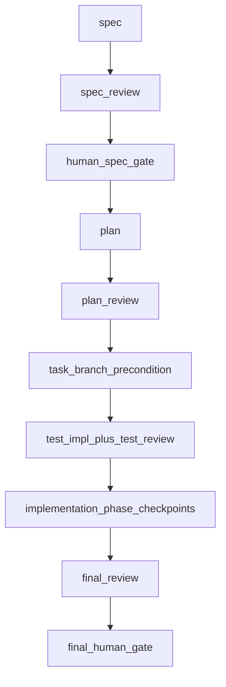

# Dev Process (Orchestrator)

This skill defines **how work is sequenced**, **who may change what**, and **where artifacts live**.
Read submodule `SKILL.md` files when operating a single stage.

## Bounded `/goal` operating contract

A short request such as `Start a new task. Goal: ...` is enough to begin a dev-process task. If the user does not provide a task id, **generate** one in the form **`YYYYMMDD_<short-slug>`** (8-digit date, underscore, slug—for example `20260509_bounded-goal-dev-process`). **Do not** generate the legacy `<slug>-YYYYMMDD` / `<slug>_YYYYMMDD` trailing-date shape **by default**. If the human **explicitly** provides a different task id, **use it as given** unless it conflicts with safety, repository policy, or filesystem constraints. Create `.hermes/tasks/<task-id>/`, initialize `state.yaml` from [templates/state.yaml](templates/state.yaml), and start at `spec`. When materializing or versioning task-root Markdown, follow § **Numbered task-root artifacts**; append **`artifacts.timeline`** in the same session when recording branch or other process events. Before asking for the spec human gate, check whether dev-process **can create** a dedicated branch for this task (or the human must explicitly direct branch choice) and record branch feasibility in the spec summary or gate artifact.

When continuing an existing task, read `.hermes/tasks/<task-id>/state.yaml` first. Resume from `current_stage`, `current_phase`, `review_rounds`, and `latest_reviews`; do not rely on chat history alone.

### legal continuation vs required stops

`/goal` may continue across ordinary stage or phase boundaries when the next action is legally allowed by `state.yaml`, gate approvals, required artifacts, latest review synthesis, role permissions, and the approved plan. Do **not** stop merely because a phase completed if the next stage is legal and the same agent/session may perform it.

A bounded advancement may be one stage, one implementation phase, one review target plus selected agents, one synthesis/status step, or a **short** legal chain of those steps until a required stop condition is reached. **Role boundary is not an automatic stop condition.** Do not stop solely because the next legal action belongs to another role.

When the next legal action requires a different role (for example PlanAgent → TestAuthorAgent → ImplementationAgent → ReviewerAgent), continue with an **explicit role transition** when the next action is legal under `state.yaml`, approvals, latest review synthesis, role permissions, and the approved plan. An explicit role transition names the new role and allowed scope; it is not a human gate. Stop with a handoff report only when continuing would be unsafe or illegal, the next role requires unavailable context/tools, or a required gate/escalation decision is pending. Do not silently change role inside the same `/goal` loop, but also do not stop solely because the next legal action belongs to another role. Normal role/stage transitions **do not require human confirmation** merely because the next action belongs to another dev-process role. Human confirmation is required only at hard human gates or when escalation, scope, safety, branch, or policy decisions require it.

Explicit role transition must not weaken review context isolation. Reviewer roles should receive approved artifacts, diffs, test outputs, and prior review summaries as needed, but not ImplementationAgent chat rationale unless explicitly requested. In particular, ImplementationAgent → ReviewerAgent transitions should preserve independent review context instead of reusing implementation rationale as review evidence.

### Hard human gates

There are two standing hard human gates:

1. `human_spec_gate` — after spec review, before plan. If human comments cause material changes to the **spec** artifact (`state.yaml` → `artifacts.spec`), update that file, rerun required spec review if material, provide an updated concise Japanese summary, and ask for human confirmation again before planning.
2. `final_human_gate` — after final review synthesis and final validation evidence, before merge/completion decision.

Before human-facing approval requests, provide a concise Japanese summary:

- `artifacts.spec_summary_ja` (path from `state.yaml`) before `human_spec_gate`: goal, non-goals, success criteria, risks, and required human decisions.
- `artifacts.final_summary_ja`: follow [templates/final_summary_ja.md](templates/final_summary_ja.md) — draft before final review (diff, validation, review focus); after final review synthesis, update with findings and recommendation before `final_human_gate`.

A short CUI approval such as `OK` is valid after the summary is provided **and after any `Required human decisions` have been presented one by one in chat with an opportunity for the human to answer or discuss them**. Human gates must not collapse multiple required human decisions into a single generic `OK` prompt. Record the approval and any comments in the relevant gate artifacts (`artifacts.human_spec_gate` / `artifacts.final_human_gate`; paths from `state.yaml`). Summary and gate artifacts remain task-local working logs and are not committed by default.

### Operational stops

Outside hard human gates, stop only when continuing would be unsafe or illegal, including:

- blocking review synthesis or unresolved escalation;
- next required action belongs to a different role **and** continuing by explicit role transition would be unsafe, illegal, or missing required context/tools;
- required artifacts are missing or inconsistent;
- continuing would change scope, public behavior, role permissions, artifact policy, branch/commit policy, or validation policy;
- the agent is uncertain which stage is legally next.

When stopping, write a short stop report:

```text
Stopped because:
What I need from the human:
Next allowed action after resolution:
Relevant artifacts:
```

Do not stop with only “phase complete” or “waiting for next instruction” unless a human gate or blocker actually requires it.

### Task branch and commits

Before asking for `human_spec_gate` approval, check whether a **new branch can be created** for this task (or whether the human will explicitly direct use of a specific branch) and record the result in `state.yaml` → `branch` and gate artifacts.

After **plan review** completes, satisfy the **task branch precondition** **before test implementation**: create the dedicated task branch for this task, or switch to the branch dev-process **already created** for this task.

**Branch rule (canonical):** all test and product work for the task must happen **only** on the dedicated branch **created by dev-process for this task**. Do not use any pre-existing branch for task work unless the human **explicitly** instructs it.

After creating or switching to the task branch, the **Orchestrator** must update, in the **same session**:

- `state.yaml` → `branch.name`
- `state.yaml` → `branch.task_branch_precondition_met`
- `state.yaml` → `branch.commits_allowed_on_task_branch` (set consistent with the agreed task/plan policy for test and product commits on the task branch)

and append a row to **`artifacts.timeline`**: if **`artifacts.timeline`** is empty, **first materialize** the timeline file per § **Numbered task-root artifacts** (set `artifacts.timeline`, then append); if already bound, **append in place** to that file (do not create a new numbered timeline file for routine branch events—see **Append-only logs** under that section) with the branch name and the create/switch command used (or equivalent evidence).

TestAuthorAgent and ImplementationAgent may **commit** only on that task branch. **Merges** and **pushes** (and commits to any other branch) are forbidden unless the human explicitly requests them. `.hermes/tasks/<task-id>/` artifacts remain uncommitted working logs by default. Never mix “product/test commits on the task branch are allowed” with “task artifacts may be committed.”

### cost-aware validation and model use

Prefer deterministic commands over LLM reasoning for mechanical checks: tests, linting, content searches, file existence, artifact paths, YAML/Markdown syntax, and simple validation that required files exist. Cheap/medium checker agents are appropriate for routine artifact completeness, checklist compliance, naming/doc consistency, and simple log summaries. Reserve higher-cost models for spec/plan reasoning, architecture/impact review, ambiguous failure diagnosis, final synthesis, and blocker triage. Cheap checkers may flag possible blockers, but final blocker decisions must escalate to synthesis or a higher-reasoning reviewer. This is process guidance, not runtime model-routing automation.

For Python validation on Python changes, precedence is: user-explicit command > project docs/config (`AGENTS.md`, README, Makefile, `pyproject.toml`, etc.) > dev-process default. If no project rule exists, plan Ruff checks per Python-changing phase, preferably `uv run ruff check <touched-python-paths>` or `.venv/bin/python -m ruff check <touched-python-paths>` when appropriate. Do not silently use unrelated system Python when the project appears to use `uv` / `.venv`; stop and report environment ambiguity.

This section documents process behavior for Hermes `/goal`; it does not implement or require Hermes CLI, gateway, slash-command, agent-loop, or executable model-routing changes. NodeFlow integration is out of scope for dev-process v3 unless a future approved task explicitly adds it.

### Review-depth preset selection

Review depth is selected by **remaining uncertainty** and **impact if broken**, not by diff size alone. First run deterministic checks where possible, then choose the smallest preset that still covers the remaining risk. Human preference for a lighter preset does not override high-risk triggers.

Canonical preset definitions live in [`review/presets.md`](review/presets.md). Do not define competing reviewer lists or synthesis rules elsewhere.

### Deterministic helper utilities

Small deterministic helpers live under [`scripts/`](scripts/) and are documented in [`scripts/README.md`](scripts/README.md). They reduce mechanical process mistakes but are **not** a workflow engine and do not replace role judgment, reviewer synthesis, human gates, or approved plans.

Current helpers:

- `validate_state.py` — task state/artifact/review/branch consistency checks.
- `review_round.py` — create a review round directory, then finish it only after real synthesis exists.
- `branch_precondition.py` — verify/record task branch precondition evidence and append a timeline row.

## Canonical pipeline (source of truth)

```text
spec
  → spec review
  → human spec gate
  → plan
  → plan review
  → task branch precondition
  → test implementation + test review
  → product implementation
  → phase checkpoint reviews
  → final review
  → final human gate
```

**Hard gate — plan before tests**

```text
Do not start test implementation until plan review is complete.
If plan review has blocking findings or escalation triggers, stop.
```

**Hard gate — task branch before tests**

```text
After plan review, satisfy the task branch precondition before starting test implementation:
create the dedicated branch dev-process uses for this task, or switch to that branch if it already exists.
Do not use any pre-existing branch for task work unless the human explicitly instructs it.
```

Parallel work is allowed only for **drafts outside the current stage** or **independent reviewer jobs**. Do not skip plan review to start tests.

## Rework after review (triage)

Blocking review outcomes are **not** automatically ImplementationAgent work. **Synthesis** assigns each blocking finding to **spec**, **plan**, **test**, **implementation**, or **human**, then the owning stage fixes, tests run, and the right reviews rerun. **ImplementationAgent does not edit tests** to clear failures unless a human documents a narrow exception. See [review/SKILL.md](review/SKILL.md#rework-routing) and [implementation/SKILL.md](implementation/SKILL.md).

## Four separations

1. **What** to build (spec) — fixed before plan.
2. **How** to build (plan) — phases, checklists, validation, forbidden changes.
3. **How to verify** (tests) — authored **after an approved plan**, **before** product implementation, by agents **other than** the ImplementationAgent.
4. **Product code** — implemented against approved spec, plan, and tests; reviewed independently.

## Module layout (do not nest test under implementation)

Correct:

```text
skills/dev-process/
  spec/
  plan/
  test/
  implementation/
  review/
```

Wrong (forbidden):

```text
skills/dev-process/implementation/test/
```

Nesting suggests tests are part of implementation; this workflow treats tests as a **sibling** phase after plan.

## Submodule index

| Stage | Skill file |
|-------|------------|
| Spec | [spec/SKILL.md](spec/SKILL.md), [spec/human_gate.md](spec/human_gate.md) |
| Plan | [plan/SKILL.md](plan/SKILL.md) |
| Test | [test/SKILL.md](test/SKILL.md) |
| Implementation | [implementation/SKILL.md](implementation/SKILL.md) |
| Review routing | [review/SKILL.md](review/SKILL.md) |

Task artifact templates live under [templates/](templates/).

## Role permissions

| Role | Product code | Test code | Task artifacts | Git |
|------|--------------|-----------|----------------|-----|
| SpecAgent | no | no | yes | no commit/push |
| PlanAgent | no | no | yes | no commit/push |
| TestAuthorAgent | no | yes | yes | may commit test changes only on the dev-process-created task branch; no merge/push |
| TestReviewerAgent | read-only | read-only | yes | no commit/push |
| ImplementationAgent | yes | **default no** (see implementation skill) | yes | may commit product changes only on the dev-process-created task branch; no merge/push |
| Reviewer agents | read-only | read-only | yes | no commit/push |
| Orchestrator | artifacts only | no | yes | may create/switch **to** the dev-process task branch for this task; no product/test commits; no merge/push |

If ImplementationAgent discovers tests are invalid or obsolete, **stop** and return work to TestAuthor/TestReviewer. **Do not silently rewrite tests** to make implementation pass.

## Artifact root

Store **per-task working state** (not the project’s long-lived source of truth) under:

```text
.hermes/tasks/<task-id>/
```

Use templates from [templates/](templates/). Copy [templates/state.yaml](templates/state.yaml) and update fields as stages complete.

### Task id

- **Task directory name** = **`task_id`**. When **agent-generated**, prefer **`YYYYMMDD_<short-slug>`** (date first); use the same value in branch names such as `dev-process/<task_id>` unless the human directs otherwise. When the human **explicitly** supplies `task_id`, use it as given (see bounded `/goal` contract above), subject to safety and filesystem constraints.

### Numbered task-root artifacts

Task-root Markdown artifacts (files directly under `.hermes/tasks/<task-id>/`, **not** under `reviews/`) use:

```text
NNNN_<stem>.md
```

**`state.yaml` → `artifacts.<key>`** holds the **current** filename for that logical artifact. **`state.yaml` itself is not numbered**—only the Markdown files use prefixes.

**Rules**

- If **`artifacts.<key>` is empty** (`""`), this is the **first materialization** of that logical artifact: compute the next prefix as **`max` of existing four-digit prefixes on task-root `NNNN_*.md` + 1** (see below; if none exist, max = −1 → **`0000_…`**), create **`NNNN_<stem>.md`**, and set **`artifacts.<key>`** to that filename in the **same session** as the file write.
- The **next** numeric prefix for any **new** numbered task-root file is **`max` of all existing four-digit prefixes** on files matching `NNNN_*.md` **in the task root** (not under `reviews/`), **plus 1**. If no such files exist yet, treat the max as **−1** so the first file uses **`0000_…`**.
- **If the artifact you are updating is already the highest-numbered** task-root file (its `NNNN` equals that max), you may **edit that file in place** and keep the same `artifacts.<key>` path.
- **If any other task-root file has a higher `NNNN`** than the file pointed to by `artifacts.<key>` for this logical artifact, **do not** overwrite that older file for a **material revision**: create a **new** file with the **next** id (`max + 1`) and **update `artifacts.<key>`** to the new filename. **Material revision** means a change that affects **decisions, approvals, plans, review outcomes, or handoff context**. **Minor typo or formatting-only** fixes may **update the bound file in place** even when a higher-numbered task-root file exists, unless project policy says otherwise.
- **Append-only logs** (`artifacts.timeline`, `artifacts.rework_log`): normally **append in place** to the file already recorded in `artifacts.*`, even when that file is **not** the highest-numbered task-root artifact. Create a **new** numbered log file only when **intentionally versioning** or replacing the log (human-agreed or documented policy).
- **Do not renumber** or rename existing numbered task-root files to “fill gaps” or reorder history.

**Review artifacts** are separate: they live under **`reviews/<stage>/round_NN/`** and **do not** use `NNNN_` prefixes—use conventional names such as `requirements.md`, `architecture.md`, `synthesis.md` (see [review/SKILL.md](review/SKILL.md)).

Legacy tasks may still use older flat names (`spec.md`, etc.); migrate with human agreement and consistent `artifacts` pointers.

See **Artifact persistence policy** below for Git and “promotion” to project docs.

## Artifact persistence policy

`.hermes/tasks/<task-id>/` holds **temporary dev-process task artifacts**—a **working log** for that development task only. These files support agents and humans *during* the task; they are **not** the project’s authoritative specification, design, or product record.

By default:

- **Do not commit** `.hermes/tasks/` artifacts to the **project** repository.  
- If a specification or design **must** become project documentation, create a **separate** project-level artifact (for example under `docs/`) intentionally curated for readers—**do not** promote `.hermes/tasks/…` paths **as-is** into canonical project docs without review and rewriting as needed.

**Do not add `.hermes/`** to the project’s tracked **`.gitignore`**: that is shared project policy and would affect collaborators who never use Hermes.

To exclude `.hermes/` locally without touching the repo’s `.gitignore`, use either:

**Global exclude (recommended on personal workstations):**

```bash
mkdir -p ~/.config/git
touch ~/.config/git/ignore
grep -qxF '.hermes/' ~/.config/git/ignore || echo '.hermes/' >> ~/.config/git/ignore

git config --global core.excludesfile ~/.config/git/ignore
```

Verify:

```bash
git config --global core.excludesfile
cat ~/.config/git/ignore
```

**This repository only (not committed)—`info/exclude`:**

```bash
EXCLUDE_FILE="$(git rev-parse --git-path info/exclude)"
grep -qxF '.hermes/' "$EXCLUDE_FILE" || echo '.hermes/' >> "$EXCLUDE_FILE"
```

**Contrast:**

| Location | Role | Typical Git handling |
|---------|------|------------------------|
| `skills/dev-process/` (this skill) | Process rules & templates | Version in the Hermes-home / skill repository |
| `<project>/.hermes/tasks/<task-id>/` | Task working log | **Do not commit** to project repo by default (see excludes above) |
| `<project>/docs/…` (or similar) | Optional **formal** project specs | Version in project repo when the team wants durable docs |

Append-only history (task root):

- [templates/timeline.md](templates/timeline.md) → `artifacts.timeline` (filename follows § **Numbered task-root artifacts** on first materialization) — chronological log of stages and artifacts.  
- [templates/rework_log.md](templates/rework_log.md) → `artifacts.rework_log` (same) — each blocking rework: source synthesis, owner, artifacts changed, rerun rounds.

### Review outputs (by stage, **round‑numbered**)

**Never overwrite** prior review outputs. Each review run writes under a **new** directory:

```text
reviews/<stage>/round_NN/
```

Use **two‑digit** `NN` (`round_01`, `round_02`, …); extend width if rounds exceed 99.

Within each `round_NN/`, use **unprefixed** conventional filenames (e.g. `requirements.md`, `architecture.md`, `synthesis.md`) per [review/SKILL.md](review/SKILL.md) and the standard recipes—**not** `NNNN_` prefixes (those apply only to **task-root** artifacts).

Example layout:

```text
reviews/
  spec/
    round_01/
      requirements.md
      architecture.md
      synthesis.md

  plan/
    round_01/
      architecture.md
      checklist_compliance.md
      impact.md
      synthesis.md
    round_02/
      ...

  test/
    round_01/
      requirements.md
      test_quality.md
      checklist_compliance.md
      synthesis.md

  implementation_phase_01/
    round_01/
      checklist_compliance.md
      diff_detail.md
      architecture.md
      synthesis.md
    round_02/
      ...

  final/
    round_01/
      architecture.md
      diff_detail.md
      impact.md
      naming_doc.md
      test_quality.md
      synthesis.md
```

**Latest synthesis pointers (`state.yaml`):** maintained by the **synthesis-role** agent (Orchestrator fallback when synthesis is skipped)—**humans should not routinely edit these** when using the normal workflow. v1 has no daemon; updates happen in the same session as synthesis.

- After each completed review round, the **synthesis-role** agent (`review/agents/synthesis.md`) **must** update `review_rounds` for that stage and set `latest_reviews.<stage>` to that round’s **`synthesis.md`** path (e.g. `reviews/spec/round_01/synthesis.md`) in the **same session** as writing that file.  
- If a team **skips synthesis** for a stage (allowed only where the router says optional), the **Orchestrator** (the agent/session coordinating handoff) performs the equivalent `review_rounds` / `latest_reviews` update and records why in **`artifacts.timeline`**.  

Detail: [review/SKILL.md — Who updates state.yaml](review/SKILL.md#who-updates-stateyaml).

**Optional shortcut:** under e.g. `reviews/final/`, `latest.md` may summarize “latest round directory + status” for humans (manual or agent-updated **v1**: no symlink automation required).

Details: [review/SKILL.md — Review rounds and rework history](review/SKILL.md#review-rounds-and-rework-history).

Use **output formats** from `review/templates/review_result.md` (per reviewer file) and `review/templates/synthesis_result.md` (for `synthesis.md`).

### Human gates

Standing human gates are:

1. **Spec human gate** after spec review, recorded at `state.yaml` → `artifacts.human_spec_gate`. Plan uses **agent review + conditional human escalation** (see [plan/SKILL.md](plan/SKILL.md)).
2. **Final human gate** after final review synthesis and final validation evidence, recorded at `state.yaml` → `artifacts.final_human_gate`.

Both gates require a concise Japanese decision summary before asking for approval. A short response such as `OK` is acceptable after the summary is provided; record it and any comments in the gate artifact.

## Safety rules

- Do not **push**, **merge**, or **commit** outside the dev-process-created task branch for this task unless explicitly requested.
- Before `human_spec_gate`, check and record whether a new branch can be created (or the human will explicitly direct branch choice). After plan review, satisfy the task branch precondition before test implementation: create the dedicated task branch for this task, or switch to the branch dev-process already created for this task. Do not use any pre-existing branch for task work unless explicitly instructed.
- Product and test commits are allowed **only** on the dev-process-created task branch. Commits to other branches, merges, and pushes remain forbidden unless explicitly requested.
- Do not modify **existing** git-untracked product/project files unless explicitly instructed. Creating **new** product or test files is allowed only when the approved plan lists them or clearly permits them. Task artifacts under `.hermes/tasks/<task-id>/` are exempt from the untracked-product rule but remain uncommitted by default.
- **Do not commit** `.hermes/tasks/` dev-process task artifacts to the project repository by default (see [Artifact persistence policy](#artifact-persistence-policy)); they are working logs, not shared project deliverables.
- Do not modify files outside the current repository.
- Do not run destructive git commands.
- In **spec**, **plan**, and **review** roles, do not edit product code.
- **TestAuthorAgent** must not edit product code.
- Prefer targeted validation commands before sweeping checks.

## Context isolation

- Reviews and final synthesis should not receive ImplementationAgent chat logs unless explicitly requested.
- Pass **approved** artifacts, **current diff** (when relevant), **test outputs**, and **review outputs**.

## Workflow diagram


