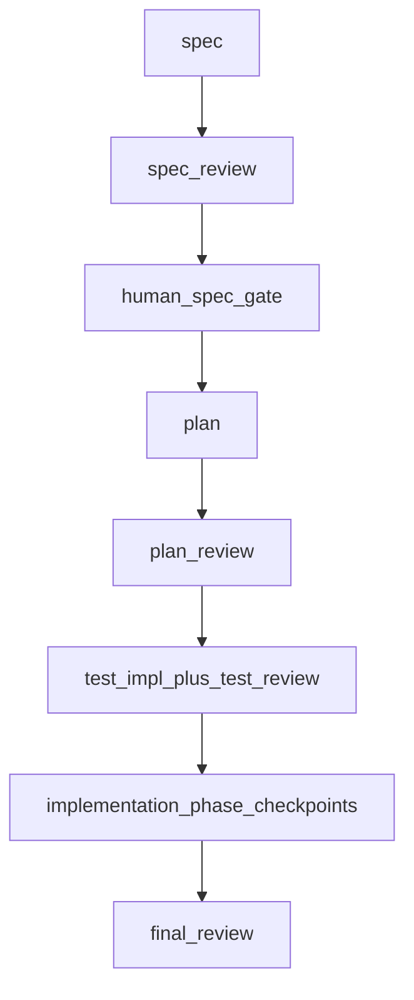

# Dev Process (Orchestrator)

This skill defines **how work is sequenced**, **who may change what**, and **where artifacts live**.
Read submodule `SKILL.md` files when operating a single stage.

## Canonical pipeline (source of truth)

```text
spec
  → spec review
  → human spec gate
  → plan
  → plan review
  → test implementation + test review
  → product implementation
  → phase checkpoint reviews
  → final review
```

**Hard gate — plan before tests**

```text
Do not start test implementation until plan review is complete.
If plan review has blocking findings or escalation triggers, stop.
```

Parallel work is allowed only for **drafts outside the current stage** or **independent reviewer jobs**. Do not skip plan review to start tests.

## Four separations

1. **What** to build (spec) — fixed before plan.
2. **How** to build (plan) — phases, checklists, validation, forbidden changes.
3. **How to verify** (tests) — authored **after an approved plan**, **before** product implementation, by agents **other than** the ImplementationAgent.
4. **Product code** — implemented against approved spec, plan, and tests; reviewed independently.

## Module layout (do not nest test under implementation)

Correct:

```text
skills/dev-process/
  spec/
  plan/
  test/
  implementation/
  review/
```

Wrong (forbidden):

```text
skills/dev-process/implementation/test/
```

Nesting suggests tests are part of implementation; this workflow treats tests as a **sibling** phase after plan.

## Submodule index

| Stage | Skill file |
|-------|------------|
| Spec | [spec/SKILL.md](spec/SKILL.md), [spec/human_gate.md](spec/human_gate.md) |
| Plan | [plan/SKILL.md](plan/SKILL.md) |
| Test | [test/SKILL.md](test/SKILL.md) |
| Implementation | [implementation/SKILL.md](implementation/SKILL.md) |
| Review routing | [review/SKILL.md](review/SKILL.md) |

Task artifact templates live under [templates/](templates/).

## Role permissions

| Role | Product code | Test code | Task artifacts | Git |
|------|--------------|-----------|----------------|-----|
| SpecAgent | no | no | yes | no commit/push |
| PlanAgent | no | no | yes | no commit/push |
| TestAuthorAgent | no | yes | yes | no commit/push |
| TestReviewerAgent | read-only | read-only | yes | no commit/push |
| ImplementationAgent | yes | **default no** (see implementation skill) | yes | no commit/push |
| Reviewer agents | read-only | read-only | yes | no commit/push |
| Orchestrator | artifacts only | no | yes | no commit/push |

If ImplementationAgent discovers tests are invalid or obsolete, **stop** and return work to TestAuthor/TestReviewer. **Do not silently rewrite tests** to make implementation pass.

## Artifact root

Store task state and documents under:

```text
.hermes/tasks/<task-id>/
```

Use templates from [templates/](templates/). Copy [templates/state.yaml](templates/state.yaml) and update fields as stages complete.

### Review outputs (by stage)

Writes under `.hermes/tasks/<task-id>/reviews/`:

```text
reviews/
  spec/
    requirements.md
    architecture.md
    synthesis.md

  plan/
    architecture.md
    checklist_compliance.md
    impact.md
    synthesis.md

  test/
    requirements.md
    test_quality.md
    checklist_compliance.md
    synthesis.md

  implementation_phase_01/
    checklist_compliance.md
    diff_detail.md
    architecture.md
    synthesis.md   # optional per phase

  final/
    architecture.md
    diff_detail.md
    impact.md
    naming_doc.md
    test_quality.md
    synthesis.md
```

Use **output formats** from `review/templates/review_result.md` (per reviewer file) and `review/templates/synthesis_result.md` (for `synthesis.md`).

### Human gate (spec only)

The only standing human gate is **after spec review**, recorded as `human_spec_gate.md`. Plan uses **agent review + conditional human escalation** (see [plan/SKILL.md](plan/SKILL.md)).

## Safety rules

- Do not commit unless explicitly requested.
- Do not push.
- Do not modify files outside the current repository.
- Do not run destructive git commands.
- In **spec**, **plan**, and **review** roles, do not edit product code.
- **TestAuthorAgent** must not edit product code.
- Prefer targeted validation commands before sweeping checks.

## Context isolation

- Reviews and final synthesis should not receive ImplementationAgent chat logs unless explicitly requested.
- Pass **approved** artifacts, **current diff** (when relevant), **test outputs**, and **review outputs**.

## Workflow diagram


