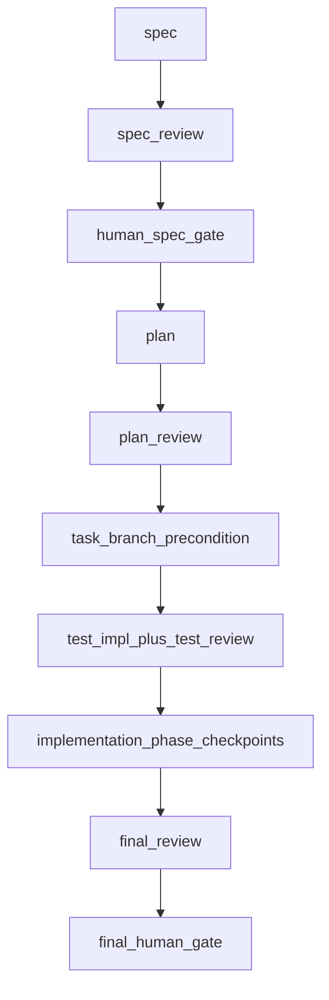

# Dev Process (`dev-process`)

This file is the **must-read orchestrator**. Keep detailed policy in focused references; do not duplicate long sections here except where tests and humans rely on a single canonical gate paragraph.

## Must-read vs reference

| Priority | Topic | Reference |
|---------|-------|-----------|
| **Must-read here** | Pipeline order, **Human gates** (dedicated heading below), role table, safety summary | this file |
| Stage work | Spec / plan / test / implementation | [spec/SKILL.md](spec/SKILL.md), [plan/SKILL.md](plan/SKILL.md), [test/SKILL.md](test/SKILL.md), [implementation/SKILL.md](implementation/SKILL.md) |
| Reviews | Router, rounds, rework | [review/SKILL.md](review/SKILL.md) |
| Presets | Light / standard / deep | [review/presets.md](review/presets.md) |
| `/goal`, stops, role transitions | Continuation contract | [goal/SKILL.md](goal/SKILL.md) |
| Branch / commits | Task branch, who may commit | [git/SKILL.md](git/SKILL.md) |
| Paths & numbering | Task-root `NNNN_`, persistence, `reviews/` layout | [artifacts/SKILL.md](artifacts/SKILL.md) |
| Validation & helpers | Cost-aware checks, safe helpers, model profile handoff | [validation/SKILL.md](validation/SKILL.md) |
| Gate prompting (companion) | Generic human-gate discipline when dev-process is loaded | [human-gates/SKILL.md](human-gates/SKILL.md) |
| Templates | Gate and task files | [templates/](templates/) |
| Scripts | Helper CLI | [scripts/README.md](scripts/README.md) |

## What to read

Load only what the current action needs; do **not** read every sub-skill by default.

| When | Read |
|------|------|
| Spec stage | [spec/SKILL.md](spec/SKILL.md), [artifacts/SKILL.md](artifacts/SKILL.md) |
| Plan stage | [plan/SKILL.md](plan/SKILL.md), [artifacts/SKILL.md](artifacts/SKILL.md), [git/SKILL.md](git/SKILL.md) |
| Test stage | [test/SKILL.md](test/SKILL.md), [artifacts/SKILL.md](artifacts/SKILL.md), [git/SKILL.md](git/SKILL.md) |
| Implementation | [implementation/SKILL.md](implementation/SKILL.md), [artifacts/SKILL.md](artifacts/SKILL.md) |
| Review round | [review/SKILL.md](review/SKILL.md), [artifacts/SKILL.md](artifacts/SKILL.md) |
| Boundary / governance | [validation/SKILL.md](validation/SKILL.md), [scripts/README.md](scripts/README.md) |
| Human gate | [human-gates/SKILL.md](human-gates/SKILL.md), [templates/](templates/) |

## Canonical pipeline

```text
spec
  → spec review
  → human spec gate
  → plan
  → plan review
  → task branch precondition
  → test implementation + test review
  → product implementation
  → phase checkpoint reviews
  → final review
  → final human gate
```

## Hard ordering

```text
Plan may start only when:
  reviewed.spec == true
  approved.human_spec_gate == true
  pending_human_gate == ""

Do not start plan before human_spec_gate is complete (same conditions as above).
Do not start test implementation before plan review is complete.
Do not edit project files for the task before the task branch precondition is satisfied.
Do not skip final_human_gate before completion / merge decision.
```

Details:

- **Plan before tests** (blocking findings, escalation): [plan/SKILL.md](plan/SKILL.md)
- **Task branch before tests** (precondition, branch choice): [git/SKILL.md](git/SKILL.md)

Parallel work is allowed only for **drafts outside the current stage** or **independent reviewer jobs**. Do not skip plan review to start tests.

NodeFlow integration is **out of scope** for dev-process v3 unless a future approved task explicitly adds it.

## Starting or continuing a task

Use [goal/SKILL.md](goal/SKILL.md) for task id format, `state.yaml` creation, resuming from `current_stage`, `/goal` continuation, explicit role transitions, and stop reports. Task artifacts are task-local; defaults and numbering: [artifacts/SKILL.md](artifacts/SKILL.md).

## Session and model evidence

Primary segment boundaries and review worker sessions must leave **third-party-verifiable** session evidence. Canonical procedures (completion conditions, not optional tips):

- **Primary loop** → [validation/SKILL.md § Primary segment boundary completion](validation/SKILL.md#primary-segment-boundary-completion) (`artifacts.model_usage` via `dp_stage_boundary.py`)
- **Review rounds** → [review/SKILL.md § Review round session evidence](review/SKILL.md#review-round-session-evidence-completion) (`review_manifest.yaml` via `dp_review_job.py`)

Do not duplicate reviewer sessions in **`artifacts.model_usage`**.

## Human gates

### State fields: reviewed, approved, pending_human_gate

```text
reviewed.<key> is a review-pass marker, where <key> is one of the reviewed.* keys defined in templates/state.yaml.
Synthesis may set reviewed.<key>: true only when the review recommendation accepts the stage, such as Proceed.
Synthesis must not set approved.*, pending_human_gate, or gate_prompted_at.

pending_human_gate is the authoritative signal for a human gate wait.
Before presenting numbered gate choices in chat, the gate presenter must update pending_human_gate and gate_prompted_at.
After any explicit human gate decision, pending_human_gate must be cleared.
If approved, set the matching canonical gate key: approved.human_spec_gate or approved.final_human_gate.
If not approved, keep the matching canonical gate key false and route the task to the appropriate rework stage.
```

**Invariants (verbatim):**

```text
reviewed.final == true does not imply approved.final_human_gate == true.

pending_human_gate != "" means the orchestrator must stop,
even if latest review recommendation is Proceed.
```

```text
reviewed.spec == true does not imply approved.human_spec_gate == true.
```

| Field | Meaning |
| --- | --- |
| `reviewed.*` | Stage review **passed** (Proceed). Synthesis sets on accept only. Not human gate approval. |
| `approved.human_spec_gate` / `approved.final_human_gate` | Human **approved** a hard gate. Only these keys are canonical in [templates/state.yaml](templates/state.yaml). |
| `approved.spec` (legacy) | **Non-canonical.** Older tasks may have it; ignore for legality. Use `approved.human_spec_gate` for spec gate. |
| `pending_human_gate` | Authoritative gate wait: `human_spec_gate` or `final_human_gate`. Empty when no wait or after any explicit gate decision. |
| `gate_prompted_at` | ISO timestamp when gate choices were prepared (before chat prompt). |

**`reviewed.*` keys** are only those in [templates/state.yaml](templates/state.yaml): `spec`, `plan`, `tests`, `final`. Do not add keys from review target names (`final_diff`, `implementation_phase`, …). Mapping: `spec` → `reviewed.spec`; `plan` → `reviewed.plan`; `test` → `reviewed.tests`; `final` / `final_diff` → `reviewed.final`; `implementation_phase` checkpoint → update `review_rounds` / `latest_reviews` only, not `reviewed.*`.

**Gate presenter order (before STOP):** (1) prepare gate artifact, (2) set `pending_human_gate` and `gate_prompted_at`, (3) append timeline `gate_prompted`, (4) present numbered choices in chat, (5) STOP. Do not update `pending_human_gate` after chat prompt as a backfill.

**After human gate decision (approve or reject/rework):** clear `pending_human_gate`. If approved, set matching **`approved.human_spec_gate`** or **`approved.final_human_gate`** to `true`. If not approved or rework is requested, keep that flag `false`, reset the matching **`reviewed.*`** marker to `false` (`reviewed.spec` for `human_spec_gate`, `reviewed.final` for `final_human_gate`), record decision in gate artifact / timeline, then move `current_stage` to the rework route.

**Plan start (spec gate):**

```text
Plan may start only when:
  reviewed.spec == true
  approved.human_spec_gate == true
  pending_human_gate == ""
```

Do not use `approved.spec`; it is not part of the canonical state model.

Standing human gates:

1. **`human_spec_gate`** — after spec review Proceed (`reviewed.spec: true`), before plan; recorded at `state.yaml` → `artifacts.human_spec_gate`. Spec gate uses `reviewed.spec`, `pending_human_gate`, and `approved.human_spec_gate` only (see Plan start above). If human comments cause material changes to **`artifacts.spec`**, update it, rerun required spec review if material, refresh the Japanese summary, and ask again before planning. Plan uses **agent review + conditional human escalation** ([plan/SKILL.md](plan/SKILL.md)).
2. **`final_human_gate`** — after final review Proceed (`reviewed.final: true`) and final validation evidence; recorded at `artifacts.final_human_gate`, before merge/completion. Final synthesis Proceed does not imply `approved.final_human_gate: true`.

Before approval, give a concise **Japanese** summary:

- **`artifacts.spec_summary_ja`** before `human_spec_gate` (goal, non-goals, success criteria, risks, required human decisions).
- **`artifacts.final_summary_ja`** per [templates/final_summary_ja.md](templates/final_summary_ja.md): draft before final review; refresh after final synthesis before `final_human_gate`.

If the spec, summary, or gate artifact contains **`Required human decisions`**, present each decision **one by one in chat** before asking for **final approval**. For each decision item:

- a **visible title** (what is being decided — do not assume the human remembers prior turns);
- decision question;
- recommended answer, if any;
- practical consequence of each option;
- whether it blocks the next stage;
- artifact section to update.

**Inline options:** list every discrete choice as **numbered or lettered lines in the same assistant message** (see [templates/human_decision_prompt.md](templates/human_decision_prompt.md)). Do **not** refer to “options above” or UI-only choice lists that may not render in the user’s client.

A short CUI approval such as `OK` is valid **after the summary is provided** **and** after any `Required human decisions` have been presented **one by one in chat**, with chance to answer or discuss — and only **after all required decision items have been individually presented** with opportunity for follow-up or changes. Human gates must not collapse multiple required human decisions into a single generic `OK` prompt. Do not ask a generic "OK?" while unresolved required human decisions remain.

Chat prompt shape: [templates/human_decision_prompt.md](templates/human_decision_prompt.md). Record approvals and discussion in **`artifacts.human_spec_gate`** / **`artifacts.final_human_gate`** (`state.yaml`). Task summaries and gates are task-local logs; **not committed** by default.

## Role permissions

| Role | Product code | Test code | Task artifacts | Git |
|------|--------------|-----------|----------------|-----|
| SpecAgent | no | no | yes | no commit/push |
| PlanAgent | no | no | yes | no commit/push |
| TestAuthorAgent | no | yes | yes | may commit test changes only on the dev-process-created task branch; no merge/push |
| TestReviewerAgent | read-only | read-only | yes | no commit/push |
| ImplementationAgent | yes | **default no** (see implementation skill) | yes | may commit product changes only on the dev-process-created task branch; no merge/push |
| Reviewer agents | read-only | read-only | yes | no commit/push |
| Orchestrator | artifacts only | no | yes | may create/switch **to** the dev-process task branch for this task; no product/test commits; no merge/push |

If ImplementationAgent discovers tests are invalid or obsolete, **stop** and return work to TestAuthor/TestReviewer. **Do not silently rewrite tests** to make implementation pass.

## Task branch and git

Summary: all test and product work on the **dev-process task branch**; Orchestrator records precondition in `state.yaml`. Full rules: [git/SKILL.md](git/SKILL.md).

## Validation and helpers

Cost-aware validation, Python/Ruff precedence, **safe deterministic helper execution**, and script listing: [validation/SKILL.md](validation/SKILL.md). Optional: Hermes profile resolution for an action or `state.yaml` stage via [`scripts/dp_hermes.py`](scripts/dp_hermes.py) — [scripts/README.md](scripts/README.md).

## Review-depth preset selection

First principles live here; canonical tables: [review/presets.md](review/presets.md). Do not define competing preset rules elsewhere.

## Rework after review (triage)

Blocking review outcomes are **not** automatically ImplementationAgent work. **Synthesis** assigns each blocking finding to **spec**, **plan**, **test**, **implementation**, or **human**, then the owning stage fixes, tests run, and the right reviews rerun. **ImplementationAgent does not edit tests** to clear failures unless a human documents a narrow exception. See [review/SKILL.md](review/SKILL.md#rework-routing) and [implementation/SKILL.md](implementation/SKILL.md).

## Four separations

1. **What** to build (spec) — fixed before plan.
2. **How** to build (plan) — phases, checklists, validation, forbidden changes.
3. **How to verify** (tests) — authored **after an approved plan**, **before** product implementation, by agents **other than** the ImplementationAgent.
4. **Product code** — implemented against approved spec, plan, and tests; reviewed independently.

## Module layout (do not nest test under implementation)

Stage modules:

```text
skills/dev-process/
  spec/
  plan/
  test/
  implementation/
  review/
```

Focused reference modules (orchestrator points here for detail):

```text
skills/dev-process/
  goal/
  git/
  artifacts/
  validation/
  human-gates/
  scripts/
  templates/
```

Wrong (forbidden):

```text
skills/dev-process/implementation/test/
```

Nesting suggests tests are part of implementation; this workflow treats tests as a **sibling** phase after plan.

## Submodule index

| Stage / topic | Skill file |
|---------------|------------|
| `/goal`, continuation | [goal/SKILL.md](goal/SKILL.md) |
| Git / task branch | [git/SKILL.md](git/SKILL.md) |
| Artifacts & paths | [artifacts/SKILL.md](artifacts/SKILL.md) |
| Validation / helpers | [validation/SKILL.md](validation/SKILL.md) |
| Human gate prompting (companion) | [human-gates/SKILL.md](human-gates/SKILL.md) |
| Spec | [spec/SKILL.md](spec/SKILL.md), [spec/human_gate.md](spec/human_gate.md) |
| Plan | [plan/SKILL.md](plan/SKILL.md) |
| Test | [test/SKILL.md](test/SKILL.md) |
| Implementation | [implementation/SKILL.md](implementation/SKILL.md) |
| Review routing | [review/SKILL.md](review/SKILL.md) |
| Presets | [review/presets.md](review/presets.md) |

Task artifact templates: [templates/](templates/).

## Safety rules

- Do not **push**, **merge**, or **commit** outside the dev-process-created task branch for this task unless explicitly requested.
- Before `human_spec_gate`, check and record branch feasibility; after plan review, satisfy task branch precondition before tests (detail: [git/SKILL.md](git/SKILL.md)).
- Product and test commits are allowed **only** on the dev-process-created task branch.
- Do not modify **existing** git-untracked product/project files unless explicitly instructed. Creating **new** product or test files is allowed only when the approved plan lists them or clearly permits them.
- **Do not commit** `.hermes/tasks/` dev-process task artifacts to the project repository by default (see [artifacts/SKILL.md — Artifact persistence policy](artifacts/SKILL.md#artifact-persistence-policy)).
- Do not modify files outside the current repository.
- Do not run destructive git commands.
- In **spec**, **plan**, and **review** roles, do not edit product code.
- **TestAuthorAgent** must not edit product code.
- Prefer targeted validation commands before sweeping checks ([validation/SKILL.md](validation/SKILL.md)).

## Context isolation

- Reviews and final synthesis should not receive ImplementationAgent chat logs unless explicitly requested.
- Pass **approved** artifacts, **current diff** (when relevant), **test outputs**, and **review outputs**.

## Workflow diagram


