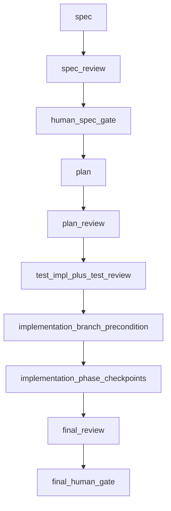

# Dev Process (Orchestrator)

This skill defines **how work is sequenced**, **who may change what**, and **where artifacts live**.
Read submodule `SKILL.md` files when operating a single stage.

## Bounded `/goal` operating contract

A short request such as `Start a new task. Goal: ...` is enough to begin a dev-process task. If the user does not provide a task id, propose or create a stable task-related id, create `.hermes/tasks/<task-id>/`, initialize `state.yaml`, and start at `spec`. Before asking for the spec human gate, check whether a task branch can be created for this task under repository policy and record that branch feasibility in the spec summary or gate artifact.

When continuing an existing task, read `.hermes/tasks/<task-id>/state.yaml` first. Resume from `current_stage`, `current_phase`, `review_rounds`, and `latest_reviews`; do not rely on chat history alone.

### legal continuation vs required stops

`/goal` may continue across ordinary stage or phase boundaries when the next action is legally allowed by `state.yaml`, gate approvals, required artifacts, latest review synthesis, role permissions, and the approved plan. Do **not** stop merely because a phase completed if the next stage is legal and the same agent/session may perform it.

A bounded advancement may be one stage, one implementation phase, one review target plus selected agents, one synthesis/status step, or a legal chain of those steps until a required stop condition is reached.

### Hard human gates

There are two standing hard human gates:

1. `human_spec_gate` — after spec review, before plan. If human comments cause material `spec.md` changes, update the spec, rerun required spec review if material, provide an updated concise Japanese summary, and ask for human confirmation again before planning.
2. `final_human_gate` — after final review synthesis and final validation evidence, before merge/completion decision.

Before human-facing approval requests, provide a concise Japanese summary:

- `spec_summary_ja.md` before `human_spec_gate`: goal, non-goals, success criteria, risks, and required human decisions.
- `final_summary_ja.md` before final review / `final_human_gate`: final diff, validation results, review findings, unresolved risks, and merge/commit recommendation.

A short CUI approval such as `OK` is valid after the summary is provided. Record the approval and any comments in the relevant gate artifact (`human_spec_gate.md` or `final_human_gate.md`). Summary and gate artifacts remain task-local working logs and are not committed by default.

### Operational stops

Outside hard human gates, stop only when continuing would be unsafe or illegal, including:

- blocking review synthesis or unresolved escalation;
- next required action belongs to a different role and handoff is needed;
- required artifacts are missing or inconsistent;
- continuing would change scope, public behavior, role permissions, artifact policy, branch/commit policy, or validation policy;
- the agent is uncertain which stage is legally next.

When stopping, write a short stop report:

```text
Stopped because:
What I need from the human:
Next allowed action after resolution:
Relevant artifacts:
```

Do not stop with only “phase complete” or “waiting for next instruction” unless a human gate or blocker actually requires it.

### Implementation branch and commits

Before asking for `human_spec_gate` approval, check whether a dedicated task branch can be created for this task and report the result to the human. Before product implementation starts, create or switch to that dedicated task branch after spec, plan, test authoring, and test review are complete. Follow repository branch policy first; otherwise use a stable task-related name such as `dev-process/<task-id>` or `feature/<short-task-slug>`.

Do not start product implementation on `main`/`master` unless repository policy explicitly requires it. Product/project changes may be committed on a branch the agent created for the task. Commits to other branches, merges into other branches, and pushes are forbidden unless the human explicitly instructs otherwise. `.hermes/tasks/<task-id>/` artifacts remain uncommitted working logs by default. Never mix “product commits are allowed” with “task artifacts may be committed.”

### cost-aware validation and model use

Prefer deterministic commands over LLM reasoning for mechanical checks: tests, linting, content searches, file existence, artifact paths, YAML/Markdown syntax, and simple validation that required files exist. Cheap/medium checker agents are appropriate for routine artifact completeness, checklist compliance, naming/doc consistency, and simple log summaries. Reserve higher-cost models for spec/plan reasoning, architecture/impact review, ambiguous failure diagnosis, final synthesis, and blocker triage. Cheap checkers may flag possible blockers, but final blocker decisions must escalate to synthesis or a higher-reasoning reviewer. This is process guidance, not runtime model-routing automation.

For Python validation on Python changes, precedence is: user-explicit command > project docs/config (`AGENTS.md`, README, Makefile, `pyproject.toml`, etc.) > dev-process default. If no project rule exists, plan Ruff checks per Python-changing phase, preferably `uv run ruff check <touched-python-paths>` or `.venv/bin/python -m ruff check <touched-python-paths>` when appropriate. Do not silently use unrelated system Python when the project appears to use `uv` / `.venv`; stop and report environment ambiguity.

This section documents process behavior for Hermes `/goal`; it does not implement or require Hermes CLI, gateway, slash-command, agent-loop, or executable model-routing changes.

## Canonical pipeline (source of truth)

```text
spec
  → spec review
  → human spec gate
  → plan
  → plan review
  → test implementation + test review
  → implementation branch precondition
  → product implementation
  → phase checkpoint reviews
  → final review
  → final human gate
```

**Hard gate — plan before tests**

```text
Do not start test implementation until plan review is complete.
If plan review has blocking findings or escalation triggers, stop.
```

Parallel work is allowed only for **drafts outside the current stage** or **independent reviewer jobs**. Do not skip plan review to start tests.

## Rework after review (triage)

Blocking review outcomes are **not** automatically ImplementationAgent work. **Synthesis** assigns each blocking finding to **spec**, **plan**, **test**, **implementation**, or **human**, then the owning stage fixes, tests run, and the right reviews rerun. **ImplementationAgent does not edit tests** to clear failures unless a human documents a narrow exception. See [review/SKILL.md](review/SKILL.md#rework-routing) and [implementation/SKILL.md](implementation/SKILL.md).

## Four separations

1. **What** to build (spec) — fixed before plan.
2. **How** to build (plan) — phases, checklists, validation, forbidden changes.
3. **How to verify** (tests) — authored **after an approved plan**, **before** product implementation, by agents **other than** the ImplementationAgent.
4. **Product code** — implemented against approved spec, plan, and tests; reviewed independently.

## Module layout (do not nest test under implementation)

Correct:

```text
skills/dev-process/
  spec/
  plan/
  test/
  implementation/
  review/
```

Wrong (forbidden):

```text
skills/dev-process/implementation/test/
```

Nesting suggests tests are part of implementation; this workflow treats tests as a **sibling** phase after plan.

## Submodule index

| Stage | Skill file |
|-------|------------|
| Spec | [spec/SKILL.md](spec/SKILL.md), [spec/human_gate.md](spec/human_gate.md) |
| Plan | [plan/SKILL.md](plan/SKILL.md) |
| Test | [test/SKILL.md](test/SKILL.md) |
| Implementation | [implementation/SKILL.md](implementation/SKILL.md) |
| Review routing | [review/SKILL.md](review/SKILL.md) |

Task artifact templates live under [templates/](templates/).

## Role permissions

| Role | Product code | Test code | Task artifacts | Git |
|------|--------------|-----------|----------------|-----|
| SpecAgent | no | no | yes | no commit/push |
| PlanAgent | no | no | yes | no commit/push |
| TestAuthorAgent | no | yes | yes | no commit/push |
| TestReviewerAgent | read-only | read-only | yes | no commit/push |
| ImplementationAgent | yes | **default no** (see implementation skill) | yes | may commit only on agent-created task branch; no merge/push |
| Reviewer agents | read-only | read-only | yes | no commit/push |
| Orchestrator | artifacts only | no | yes | no merge/push; no commits except explicit task-branch handoff policy |

If ImplementationAgent discovers tests are invalid or obsolete, **stop** and return work to TestAuthor/TestReviewer. **Do not silently rewrite tests** to make implementation pass.

## Artifact root

Store **per-task working state** (not the project’s long-lived source of truth) under:

```text
.hermes/tasks/<task-id>/
```

Use templates from [templates/](templates/). Copy [templates/state.yaml](templates/state.yaml) and update fields as stages complete.

See **Artifact persistence policy** below for Git and “promotion” to project docs.

## Artifact persistence policy

`.hermes/tasks/<task-id>/` holds **temporary dev-process task artifacts**—a **working log** for that development task only. These files support agents and humans *during* the task; they are **not** the project’s authoritative specification, design, or product record.

By default:

- **Do not commit** `.hermes/tasks/` artifacts to the **project** repository.  
- If a specification or design **must** become project documentation, create a **separate** project-level artifact (for example under `docs/`) intentionally curated for readers—**do not** promote `.hermes/tasks/…` paths **as-is** into canonical project docs without review and rewriting as needed.

**Do not add `.hermes/`** to the project’s tracked **`.gitignore`**: that is shared project policy and would affect collaborators who never use Hermes.

To exclude `.hermes/` locally without touching the repo’s `.gitignore`, use either:

**Global exclude (recommended on personal workstations):**

```bash
mkdir -p ~/.config/git
touch ~/.config/git/ignore
grep -qxF '.hermes/' ~/.config/git/ignore || echo '.hermes/' >> ~/.config/git/ignore

git config --global core.excludesfile ~/.config/git/ignore
```

Verify:

```bash
git config --global core.excludesfile
cat ~/.config/git/ignore
```

**This repository only (not committed)—`info/exclude`:**

```bash
EXCLUDE_FILE="$(git rev-parse --git-path info/exclude)"
grep -qxF '.hermes/' "$EXCLUDE_FILE" || echo '.hermes/' >> "$EXCLUDE_FILE"
```

**Contrast:**

| Location | Role | Typical Git handling |
|---------|------|------------------------|
| `skills/dev-process/` (this skill) | Process rules & templates | Version in the Hermes-home / skill repository |
| `<project>/.hermes/tasks/<task-id>/` | Task working log | **Do not commit** to project repo by default (see excludes above) |
| `<project>/docs/…` (or similar) | Optional **formal** project specs | Version in project repo when the team wants durable docs |

Append-only history (task root):

- [templates/timeline.md](templates/timeline.md) → `timeline.md` — chronological log of stages and artifacts.  
- [templates/rework_log.md](templates/rework_log.md) → `rework_log.md` — each blocking rework: source synthesis, owner, artifacts changed, rerun rounds.

### Review outputs (by stage, **round‑numbered**)

**Never overwrite** prior review outputs. Each review run writes under a **new** directory:

```text
reviews/<stage>/round_NN/
```

Use **two‑digit** `NN` (`round_01`, `round_02`, …); extend width if rounds exceed 99.

Example layout:

```text
reviews/
  spec/
    round_01/
      requirements.md
      architecture.md
      synthesis.md

  plan/
    round_01/
      architecture.md
      checklist_compliance.md
      impact.md
      synthesis.md
    round_02/
      ...

  test/
    round_01/
      ...

  implementation_phase_01/
    round_01/
      checklist_compliance.md
      diff_detail.md
      architecture.md
      synthesis.md
    round_02/
      ...

  final/
    round_01/
      architecture.md
      diff_detail.md
      impact.md
      naming_doc.md
      test_quality.md
      synthesis.md
```

**Latest synthesis pointers (`state.yaml`):** maintained by the **synthesis-role** agent (Orchestrator fallback when synthesis is skipped)—**humans should not routinely edit these** when using the normal workflow. v1 has no daemon; updates happen in the same session as synthesis.

- After each completed review round, the **synthesis-role** agent (`review/agents/synthesis.md`) **must** update `review_rounds` for that stage and set `latest_reviews.<stage>` to that round’s `synthesis.md` path in the **same session** as writing `reviews/<stage>/round_NN/synthesis.md`.  
- If a team **skips synthesis** for a stage (allowed only where the router says optional), the **Orchestrator** (the agent/session coordinating handoff) performs the equivalent `review_rounds` / `latest_reviews` update and records why in `timeline.md`.  

Detail: [review/SKILL.md — Who updates state.yaml](review/SKILL.md#who-updates-stateyaml).

**Optional shortcut:** under e.g. `reviews/final/`, `latest.md` may summarize “latest round directory + status” for humans (manual or agent-updated **v1**: no symlink automation required).

Details: [review/SKILL.md — Review rounds and rework history](review/SKILL.md#review-rounds-and-rework-history).

Use **output formats** from `review/templates/review_result.md` (per reviewer file) and `review/templates/synthesis_result.md` (for `synthesis.md`).

### Human gates

Standing human gates are:

1. **Spec human gate** after spec review, recorded as `human_spec_gate.md`. Plan uses **agent review + conditional human escalation** (see [plan/SKILL.md](plan/SKILL.md)).
2. **Final human gate** after final review synthesis and final validation evidence, recorded as `final_human_gate.md`.

Both gates require a concise Japanese decision summary before asking for approval. A short response such as `OK` is acceptable after the summary is provided; record it and any comments in the gate artifact.

## Safety rules

- Do not **push**, **merge**, or commit to branches other than the agent-created task branch unless explicitly requested.
- Before `human_spec_gate`, check and report whether a dedicated task branch can be created for the task. Before product implementation, create or switch to that dedicated task branch unless repository policy explicitly says otherwise; do not start implementation on `main`/`master` by default.
- Product/project commits are allowed on a branch the agent created for the task. Commits to other branches, merges, and pushes remain forbidden unless explicitly requested.
- Do not modify git-untracked product/project files without explicit human permission. If the user has not instructed you to modify an untracked file, leave it alone.
- **Do not commit** `.hermes/tasks/` dev-process task artifacts to the project repository by default (see [Artifact persistence policy](#artifact-persistence-policy)); they are working logs, not shared project deliverables.
- Do not modify files outside the current repository.
- Do not run destructive git commands.
- In **spec**, **plan**, and **review** roles, do not edit product code.
- **TestAuthorAgent** must not edit product code.
- Prefer targeted validation commands before sweeping checks.

## Context isolation

- Reviews and final synthesis should not receive ImplementationAgent chat logs unless explicitly requested.
- Pass **approved** artifacts, **current diff** (when relevant), **test outputs**, and **review outputs**.

## Workflow diagram


